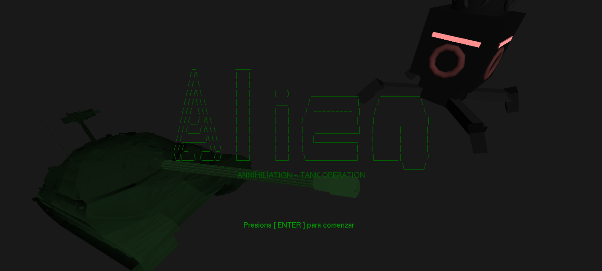
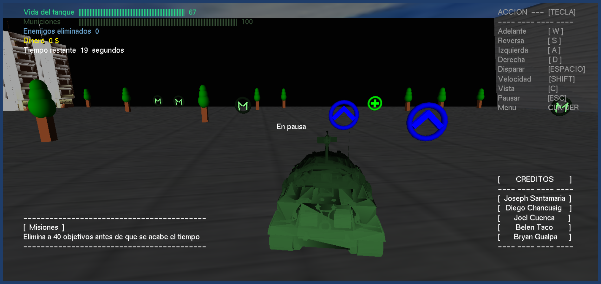

# Alien Annihiliation: Tank Operation

> 👽 Videogame make with OpenGL, C++ and love by Joseph Santamaria

## 🎮 Controls

Forward -------------- [ W ] 
Back ------------------ [ S ] 
Left -------------------- [ A ] 
Right ------------------ [ D ] 
Shoot ----------------- [ SPACE ] 
Speed up ------------ [ SHIFT ]
Change view ------- [ C ]
Pause ---------------- [ ESC ]

## 📺 Gameplay

> Kill 40 enemies before time's up

> Pick up the boosts spread across the map

> Keep your ammo stocked

> Keep your health up

> Run, Run, Run

## 🧑‍💻 Development and design

<a href="https://joseph-san.com/" style="display: flex; justify-content: start; align-items: center; margin-bottom: 20px; color:white; mix-blend-mode:difference;">
    
    Joseph Santamaria - Interactive developer & Creative designer
</a>

> Diego Chancusig - Designer and developer
